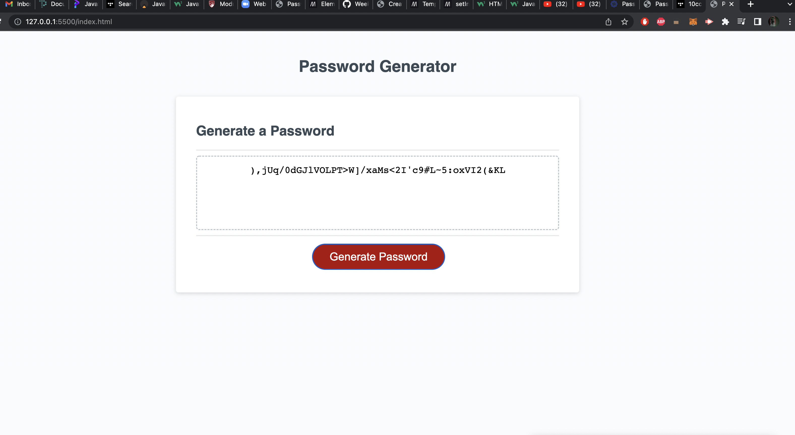

# Week-3-Challenge

## JavaScript based password generator

created three functions to generate a user password
based on type of alphanumericals chosen and character length
these characters were chosen using math.random & math.floor

